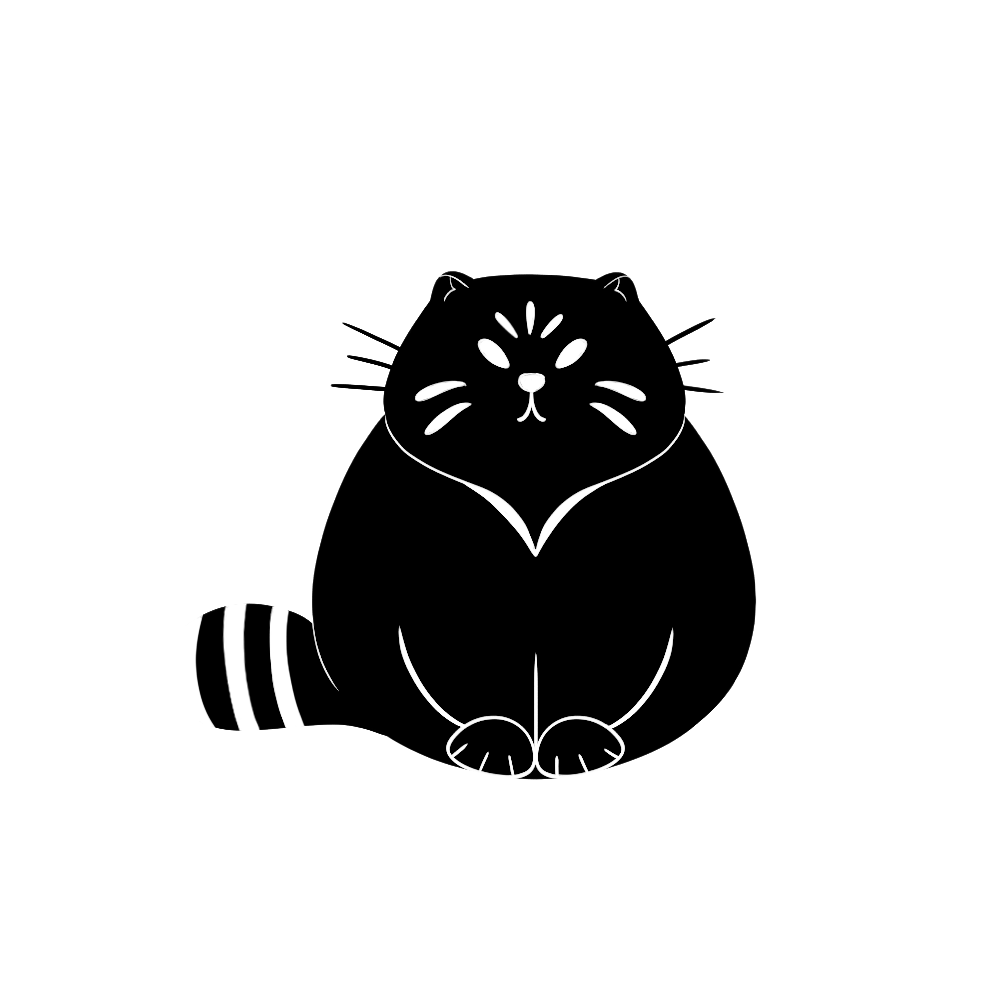

# Personal assistant (Manul) for my needs.

Originally, I thought to make it in go, but since I need it asap, I decided to make it in node.

# What it does
1. Bunch of CLI commands which goes like:
```
manul *name of the command*
```
2. Telegram integration for useful stuff (for example, reminders)
# TODO

1. ~~Create telegram script which sends wiki potd every morning~~
2. Create proper project structure. Here is the most important part. Now is good for prototyping, but need to think through on architecture. Probably, some functional style will be good.
3. Start test coverage.
4. Write cron scripts in separate folder
5. ~~Make cli work with typescript~~
6. ~~Write script for tracking pressure in google sheets TODO: Maybe, get rid of google sheets and use local instead. Their api is horrible. Just store the table on serverside~~